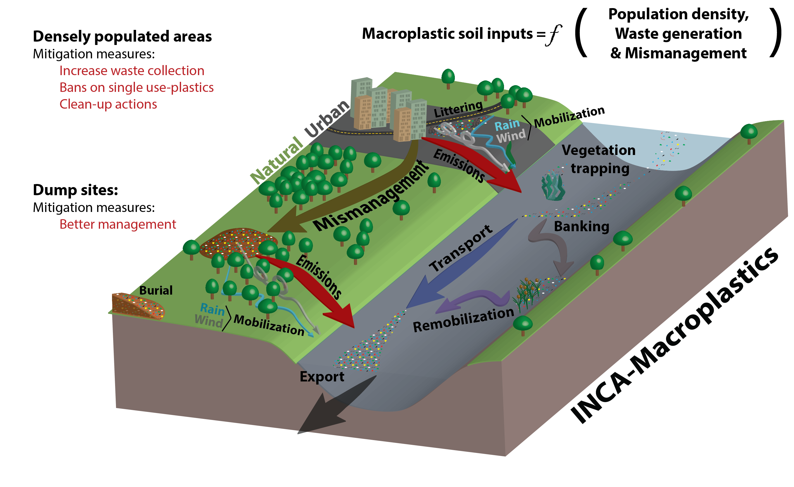

# IncaMacroplastics with soil

IncaMacroplastics is building on the hydrology model PERSiST to simulate the burial, transport over land and in the river, immobilization, 
and mobilization of plastic items in a river catchment from emission sources on land to the river outlet.

