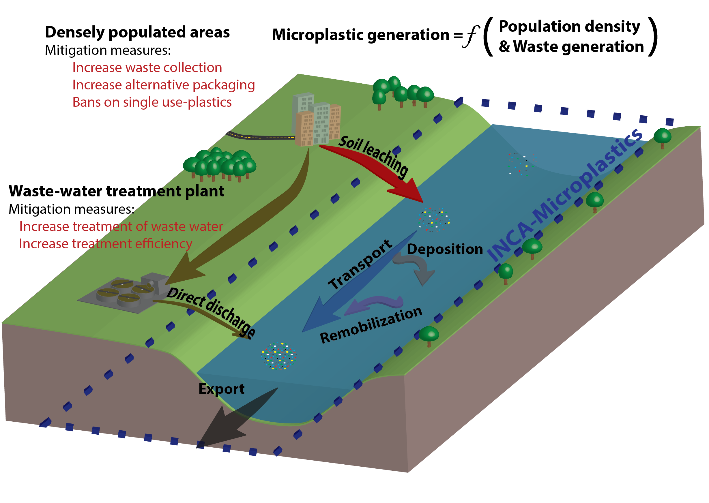

# IncaMicroplastics

IncaMicroplastics is building on the hydrology model PERSiST to simulate the mobilization from soils to the river, deposition in river sediment 
and transport through the river network down to the river outlet.

A demonstration web-app is available at: https://ikhapp.org/inca-microplastics/

