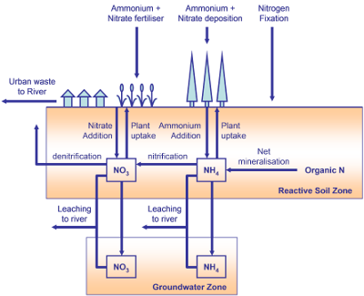

# INCA-N

INCA-N is a Mobius continuation of the Integrated Nitrogen CAtchment model, previously coded by Dan Butterfield.

INCA-N simulates (parts of) the [nitrogen cycle](https://en.wikipedia.org/wiki/Nitrogen_cycle) on a river basin scale along with inputs from various sources, in-soil processes, and eventually transport of diluted nitrate and ammonium through the (possibly branched) river network. The simulation is *semi-distributed* over different subcatchments and landscape units (land use classes).

INCA-N was originally developed (under the name INCA) by Paul G. Whitehead in 1995 (Whitehead et. al. 1998). It later received contributions by Andrew Wade, Kateri Rankinen and others.

The model was an early attempt to assess the impact of point and diffuse nitrogen sources on in-stream chemistry in an integrated manner, simulating soil and stream water flow and nitrate and ammonium concentrations, as well as calculating nitrogen process loads (Whitehead et. al. 1998)

One fairly up to date description of the model can be found in Wade et. al. 2002, though there have been some additions to it since then.

## Difference from earlier versions

The Mobius version of INCA-N is different from earlier versions in that it is integrated with the PERSiST hydrology model (Futter et. al. 2014). This saves the user from running a separate hydrology model first and then port the results of that over to a format readable by INCA. A description of the PERSiST hydrology model can be found here: [PERSiST paper](https://pdfs.semanticscholar.org/2e46/db20c4f6dfa1bcdb45f071ce784cc5a6a873.pdf)

Apart from that, Mobius INCA-N has mostly the same features as the original INCA-N 1.9.x.

Some small differences are:
- Wet depositions are currently not spread out with precipitation, but are instead delivered as constant daily doses (or following an input timeseries if that is provided)
- Land cover that changes over time is not implemented until we find a way to do it that preserves stored quantities (but there may be workarounds. Take contact if you need this).

If you are a previous user of INCA-N, see this [guidance on switching to the Mobius version](https://github.com/NIVANorge/Mobius/blob/master/Applications/IncaN/Guidance_on_switching_to_framework_version.txt)

The version numbers found in this repository refer to the version number of the Mobius implementation of the model only, and is not compatible with earlier version numbers.

## Completely new users

Unfortunately there is no comprehensive full description of this version of the model at the moment, but you can piece together the essentials from the listed papers, and also see the [module source code](https://github.com/NIVANorge/Mobius/blob/master/Modules/INCA-N.h), which is written to be as readable as possible.

## Parameter and input formats

See the [general description of parameter and input formats in Mobius](https://github.com/NIVANorge/Mobius/blob/master/Documentation/file_format_documentation.pdf).

INCA-N builds on PERSiST, and so has all the same input requirements and options as PERSiST. See the inputs that are required by the [PERSiST module](https://github.com/NIVANorge/Mobius/blob/master/Applications/PERSiST).

Here we list the ones that are added on top of that by INCA-N.

### Required inputs

None apart from the ones in PERSiST.

### Optional inputs

If an optional input is provided at all it has to have to have a value for every day of the period you intend to run the model. If it is not included, a value is typically computed for it instead based on parameter values. If you give an optional input an index set dependency, it is fine if you only provide a timeseries for some of the indexes. The value for the other indexes will then be computed as normal.

* **"Fertilizer nitrate"**. How much NO3 is added by fertilization, in kg/Ha/day. Replaces the computed fertilisation. Recommended index set dependencies: {"Landscape units"} or {"Reaches" "Landscape units"}.
* **"Fertilizer ammonium"**. How much NH4 is added by fertilization, in kg/Ha/day. Replaces the computed fertilisation. Recommended index set dependencies: {"Landscape units"} or {"Reaches" "Landscape units"}.
* **"Nitrate dry deposition"**. In kg/Ha/day. Replaces the parameter of the same name.
* **"Ammonium dry deposition"**. In kg/Ha/day. Replaces the parameter of the same name.
* **"Nitrate wet deposition"**. In kg/Ha/day. Gives the actual wet deposition to the soil instead of having it computed based on the parameter and the precipitation.
* **"Ammonium wet deposition"**. In kg/Ha/day. Gives the actual wet deposition to the soil instead of having it computed based on the parameter and the precipitation.
* **"Effluent nitrate concentration"**. In mg/l. Replaces the parameter "Reach effluent nitrate concentration".
* **"Effluent ammonium concentration"**. In $mg/l$. Replaces the parameter "Reach effluent ammonium concentration".

It may be convenient to use the format of constant periods to specify e.g. fertilization inputs. An example of that is:

"Fertilizer nitrate" :
2004-04-10 to 2004-06-01 0.01
<..etc..>

There is also the possibility to specify multiple plant growth periods (which will influence plant ammonium uptake). This is done using the optional timeseries **"Growth curve offset"** and **"Growth curve amplitude"**. They should be specified using the constant periods format as in the next example. It is important that the periods in these two timeseries match up. This replaces the parameter-based growth periods.

"Growth curve offset" :
2004-04-10 to 2004-06-01 0.33
2004-03-27 to 2004-06-15 0.31

"Growth curve amplitude" :
2004-04-10 to 2004-06-01 0.67
2004-03-27 to 2004-06-15 0.69

As with any other optional timeseries, you can give these index set dependencies, but it is important that "Growth curve offset" and "Growth curve amplitude" are given the same dependencies and that any pair of these with the same indexes match up. If series are not provided for some indexes, the growth period will be based on the parameters for those indexes as usual.

## Existing application examples

- The *Tarland* example is roughly calibrated on Nitrate and Ammonium concentrations in the reach.
- The *Storelva* example is calibrated on Nitrate concentration only, but with a fairly good fit. It also features dynamic fertilization and deposition inputs that vary from year to year.
- The *Tovdal* example is not calibrated, but can serve as a starting point if you want to have an exercise at calibrating on a multi-reach setup.

## References

P. G. Whitehead, E. J. Wilson, and D. Butterfield, 1998a, *A semi-distributed Integrated Nitrogen Catchment model for multiple source assessment in Catchments (INCA): Part I - model structure and process equations*, The science of the Total Environment, 210/211, 547-558

P. G. Whitehead, E. J. Wilson, and D. Butterfield, 1998b, *A semi-distributed Integrated Nitrogen Catchment model for multiple source assessment in Catchments (INCA): Part II - application to large river basins in south Wales and eastern England*, The science of the Total Environment, 210/211, 559-583

A.J Wade, P. Durand, V. Beaujouan, W. W. Wessel, K. J. Raat, P. G. Whitehead, D. Butterfield, K. Rankinen and A. Lepisto 2002, *A nitrogen model for European catchments: INCA, new model structure and equations*, Hydrology and Earth System Sciences, 6(3), 559-582 (2002)

M. N. Futter, M. A. Erlandsson, D. Butterfield, P. G. Whitehead, S. K. Oni, and A. J. Wade, 2014, *PERSiST: a flexible rainfall-runoff modelling toolkit for use with the INCA family of models*, Hydrol. Earth Syst. Sci., 18, 855-873
