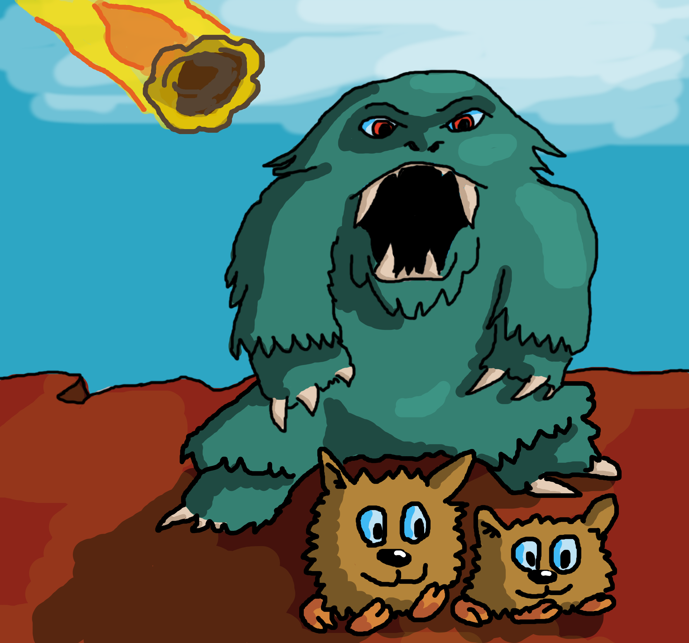

# Tutorial 3 : Introducing the Giblet-Thrasher model

This is the saga of the Giblets and the Thrashers. The Giblets are furry little creatures that live a peaceful life skipping around on the rocks on the nice and sunny plateau. However incursions of large Giblet-eating Thrashers onto the plateau may force some of the Giblets to seek refuge in the nasty forests and bogs.

